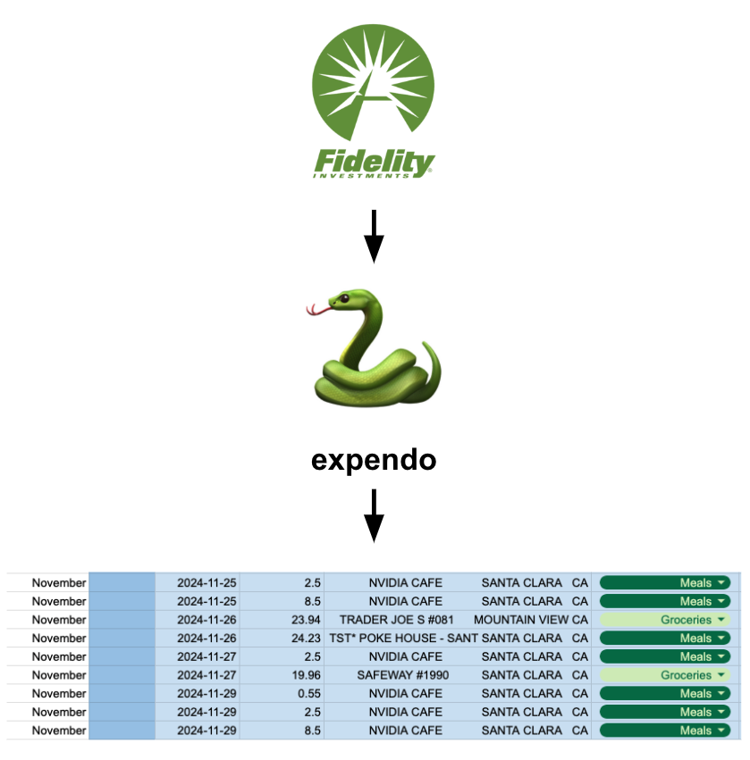

# expendo 💸



Personal automation tool to track my expenses.  

Parses credit card transaction history file, infers expenditure categories based on the transaction metadata (text embedding similarity based on description), and uses the Google API Client to update an expenses spreadsheet. 

## Usage

1. Setup environment:
  ```shell
  cd python
  conda create -n expendo python=3.11 -y
  conda activate expendo
  pip install -r requirements.txt
  ```

2. For first time usage, create `credentials.json`. Navigate to: [Google Cloud console](https://console.cloud.google.com/apis/) > Credentials > Create credentials > OAuth client ID. Upload to `python/auth/credentials.json`. Expendo will cache the auth token on first sign-in.  

3. Upload transaction history as CSV.  

4. Run `main.py`, or to run interactively, `main.ipynb`.

## Todo:

- More generalizable approach (lightweight web search?) to infer categories.
- Auto-pull monthly transaction history somehow - Fidelity doesn't have a public API :(.
- Annual summary - totals, spending trends, highest months, etc.
