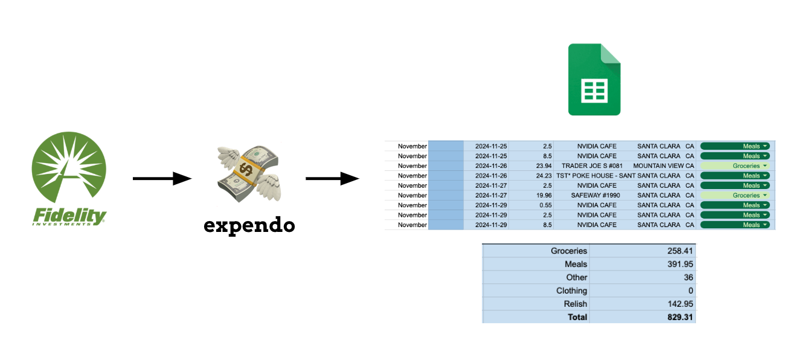

# expendo 💸



Automation tool to track my expenses.  

Parses credit card transaction history file, automatically infers expenditure categories based on the transaction metadata (text embedding similarity based on description), and uses the Google API Client to update an expenses spreadsheet. 

## Usage

```shell
cd python
conda create -n expendo python=3.11 -y
pip install -r requirements.txt
```

Upload transaction history as CSV.  
Run `main.py` or `main.ipynb`.
